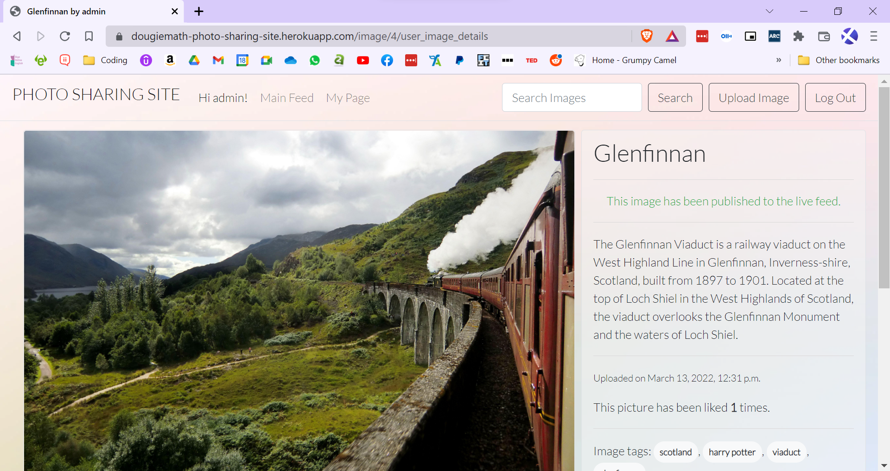

# Photo Sharing Site


___

## About

As a keen amateur photographer I wanted a private site to share my photos.  Social Media offers a fine alternative, but, as an image owner, I was never happy with the lack of control I had over who says what about my images.  

This site was designed as a place for people to come together to share their own photos – whether they are professional or not.  The intention is to foster a community of photographers where ownership of content remains in their hands.

___

## UX

#### User Stories – Site User
* As a Site User I can view a list of images so I can choose which one to learn more about
* As a Site User I can search for images by tag so that I can only see images that I want to see.
* As a Site User I can click on an image to access more information it so that I can learn more about it.
* As a Site User I can upload my own images so that I can share my content.
* As a Site User I can delete my posts so that can retain control of my images
* As a Site User I can view comments made from other users so I can read an existing conversation and join in.
* As a Site User I can leave comments on a picture/post so that I can start/join a conversation
* As a site User I can like other users' pictures so that I can interact with the site
* As a Site User I can view the number of likes to see which image is more popular
* As a Site User I can Register for an account to be able to share my pictures.
* As I Site User I can reset my password so that I can log in if I forget my credentials.

#### User Stories – Site Admin
* As a Site Admin I can remove users so that I can ensure a code of conduct is followed
* As a Site Admin I can remove photos/posts so that I can keep the content family friendly
* As a Site Admin I can create draft content so that I can leave and finish it at a later time
* As a Site Admin I can upload photos/create posts so that I can manage my site's content.
* As a Site Admin I can remove comments that are offensive so I can keep the comment section family friendly

___

## Wireframes

[Desktop image Grid](pss-screenshots/wireframes/wirefram-homepage-desktop-view.png)

[Mobile Image Grid](pss-screenshots/wireframes/wirefram-homepage-mobile-view.png)

[Desktop Image Content](pss-screenshots/wireframes/wirefram-image-detail-desktop-view.png)

[Mobile Image Content](pss-screenshots/wireframes/wirefram-image-detail-mobile-view.png)

___

## Features
### Landing Page


The home page displays a thumbnail grid (Clocade View) of all of the published images on the site.  The navigation bar for users who are not logged in contains a 'login' and 'sign up' link.  The site title serves as a link to this page.

For logged in users:


The thumbnail grid content remains the same, but the navigation bar now shows the users name, a link to the users page, a seach bar, a link to a page to upload an image and a log out link.
___ 

### User's Page:

The same grid has been employed for continuity purposes but this grid will display ONLY images that belong to the user - both published and draft.


___

### Image Details

There are 3 image detail views: 
1 - for not logged in users
2 - public images for logged in users
3 - an image detail view for a user's own image

Image details for non-logged in users:


There is the picture in an enlarged form with information about it.  There is also the image's tags so a user can search for other images with the same tag.  There is NO option to 'like' this image nad no option to 'comment'

Image details for logged-in users:


There is now an option to 'like' the image with the ability to add a comment below:


Image details for User's own image:


This screensht shows an image which has not been made public yet.  There are instructions on how to do so.  Once it is made public, the user will see this:



___

### Log In

The user is presented with a log in form that was styled using Crispy Forms.  Crispy Forms was chosen for all forms. There is also an option to reset passwords.


___ 

### Sign Up

The user must sign up with an email address as they will be unable to access the site without.  If the user fails to complete any field, the sign-up process will fail.


___

### Forgot Password

The user will have an opportunity to reset their password by entering their email address and following a link that they will receive in their email.


___

### Log Out

The user is not logged out on clicking the link in the nav bar, but directed to a confirmation page.


___

### Upload an Image

This is the image upload screen where users can upload images in a number of formats, including but not limited to:'bmp', 'dib 'ps', 'flc', 'gif', 'png', 'ico', 'tiff', 'jpg', 'jpeg'.  It should be noted that RAW fils (.raw) cannot be uploaded.


___

### Edit an Image

If the user notices a spelling/factual error after publishing their image, they can fix it here.  They can also change the uploaded image.


___

### Delete an Image

The user will be given an opportunity to back out of the deletion process.  Once an image is deleted from the database it cannot be recovered.


___

## Testing

### PEP8 Validation

All code was copied and pasted into [PEP8 Online](http://pep8online.com/)

[admin.py results](pss-screenshots/pep8/adminpy-pep8-validation-results.png)

[forms.py results](pss-screenshots/pep8/formspy-pep8-validation-results.png)

[models.py results](pss-screenshots/pep8/modelspy-pep8-validation-results.png)

[urls.py results](pss-screenshots/pep8/urlspy-pep8-validation-results.png)

[views.py results](pss-screenshots/pep8/viewspy-pep8-validation-results.png)


### 

### Manual Testing

There was no automated testing carried out during this project.  Each User Story was manually tested as follows:

### As a Site User I can view a list of images so I can choose which one to learn more about

| Test                                                    | Result                                      | Verdict |
|---------------------------------------------------------|---------------------------------------------|---------|
| Entered the site's URL                                  | All public images are displayed.            | Pass    |
| Signed up & Logged into site and clicked on 'Main Feed' | All public images are displayed.            | Pass    |
| Signed up & Logged into Site and clicked on 'My Page'   | All images owned by the user are displayed. | Pass    |

### As a Site User I can search for images by tag so that I can only see images that I want to see.

| Test                                                                                                  | Result                                                                      | Verdict |
|-------------------------------------------------------------------------------------------------------|-----------------------------------------------------------------------------|---------|
| Entered the site's URL and selected a random image.  From here, clicked on one of the displayed tags. | Clicking on tag directs user to a page displaying images with the same tag. |     |
| Signed up & Logged into site and clicked on 'Main Feed' and selected a random image.  From here, clicked on one of the displayed tags.                                               | Clicking on tag directs user to a page displaying images with the same tag.                                                                            | Pass    |
| Signed up & Logged into Site and clicked on 'My Page' and selected a random image.  From here, clicked on one of the displayed tags.                                                  | Clicking on tag directs user to a page displaying images with the same tag.                                                                            | Pass    |

### As a Site User I can click on an image to access more information it so that I can learn more about it.

| Test                                                                                                  | Result                                                                        | Verdict |
|-------------------------------------------------------------------------------------------------------|-------------------------------------------------------------------------------|---------|
| Entered the site's URL and selected a random image.  From here, clicked on one of the displayed tags. | Clicking on image displays large copy of image and more information about it. | Pass    |
| Signed up & Logged into site and clicked on 'Main Feed' and selected a random image.                  | Clicking on image displays large copy of image and more information about it.                                                                              | Pass    |
| Signed up & Logged into Site and clicked on 'My Page' and selected a random image.                    | Clicking on image displays large copy of image and more information about it.                                                                              | Pass    |


### As a Site User I can upload my own images so that I can share my content.

| Test                                                                             | Result                                                                                          | Verdict |
|----------------------------------------------------------------------------------|-------------------------------------------------------------------------------------------------|---------|
| Entered the site's URL and attempted to click 'Upload an Image'                  | Cannot access the image upload section without a user account - Button is not present.                                   | Pass    |
| Signed up & Logged into site and clicked on 'Upload an Image'                    | Image Upload section displays.                                                                  | Pass    |
| Completed form by adding: title, .png file, description, tag and setting status to 'Published'. | Image uploaded successfully and displays as the first image in the public feed and user's page. | Pass    |
| Completed form by leaving one field blank.                                       | Site will not allow user to complete the upload process with one or more empty fields.          | Pass    |   
    

### As a Site Admin I can create draft content so that I can leave and finish it at a later time
(This was implemented for all users.)

| Test                                                                                            | Result                                                                                                                        | Verdict |
|-------------------------------------------------------------------------------------------------|-------------------------------------------------------------------------------------------------------------------------------|---------|
| Entered the site's URL and attempted to click 'Upload an Image'                                 | Cannot access the image upload section without a user account  - button is not present                                                               | Pass    |
| Signed up & Logged into site and clicked on 'Upload an Image'                                   | Image Upload section displays.                                                                                                | Pass    |
| Completed form by adding: title, .png file, description, tag and setting status to 'Published'. | Image uploaded successfully and displays as the first image in the public feed and user's page.                               | Pass    |
| Completed form by adding: title, .png file, description, tag, and setting status to 'Draft'     | Image uploaded successfully and displays as the first image on the user's page only.  Image does not display on the man feed. | Pass    |


### As a Site User I can delete my posts so that can retain control of my images

| Test                                                          | Result                                                                                                   | Verdict |
|---------------------------------------------------------------|----------------------------------------------------------------------------------------------------------|---------|
| Entered the site as a logged-in user and clicked on 'My Page' | List of images that are public and private to the user displayed.                                        |         |
| Clicked on a random image.                                    | Image details displayed with option to 'Edit Image' and 'Delete Image'                                   |         |
| Clicked on 'Delete Image'                                     | Directed to page asking if user is certain. Two buttons are presented to the user: 'Cancel' and 'Delete' |         |
| Clicked on 'Delete'                                           | Image was removed from user's page and public feed.                                                      |         |
| Accessed Admin as superuser                                   | Image was removed from database                                                                          | Pass    |
| **Test 2**                                                    | **Result**                                                                                                         | **Verdict**        |
| Entered the site as a logged-in user and clicked on 'My Page' | Entered the site as a logged-in user and clicked on 'My Page'                                            |         |
| Clicked on a random image.                                    | Image details displayed with option to 'Edit Image' and 'Delete Image'                                   |         |
| Clicked on 'Delete Image'                                     | Directed to page asking if user is certain. Two buttons are presented to the user: 'Cancel' and 'Delete' |         |
| Clicked on 'Cancel'                                           | Returned to the image details page.  Image is not deleted.                                               | Pass    |

### As a Site User I can view/leave comments made from other users so I can read an existing conversation and join in.

| Test - View Comments                                                | Result                                                                                                                                     | Verdict |
|---------------------------------------------------------------------|--------------------------------------------------------------------------------------------------------------------------------------------|---------|
| Entered the site as a logged-in user and clicked on a random image. | Image Details page for chosen image displays. Comments feed displays below image with button to 'Add Comment'.                             | Pass    |
| **Test - Add Comments**                                             | **Result**                                                                                                                                           | **Verdict**         |
| Entered the site as a logged-in user and clicked on a random image. | Image Details page for chosen image displays. Comments feed displays below image with button to 'Add Comment'.                             |         |
| Clicked 'Add Comment'                                               | Directed to 'Add Comment' page and presented with a text box and two buttons: 'Add' and 'Exit Without Saving'                              |         |
| Added information to text input and clicked 'Add'                   | Comment added to image.  Directed to Image details page and new comment is at the top of the comments list with comment author displaying. | Pass    |
| No information added and clicked 'Add'                              | Error message displays.  It is not possible to add a blank comment.                                                                        | Pass    |
| Attempted to spam comment body with extremely long comment          | Comment body prevents comments longer than 500 characters.                                                                                 | Pass    |
| Clicked 'Exit Without Saving'                                       | Directed back to image, no comment is displayed. Checking 'Admin' confirms no comment is logged.                                           | Pass    |


### As a site User I can like/ view the number of likes other users' pictures so that I can interact with the site

| Test                                                                    | Result                                                                                                                                                                                           | Verdict |
|-------------------------------------------------------------------------|--------------------------------------------------------------------------------------------------------------------------------------------------------------------------------------------------|---------|
| Entered site URL and clicked on a random image as a non-logged-in user. | Directed to Image Details page for the image that I selected.  On this page is displayed a message telling the user to log in in order to 'Like' the image.  The number of 'Likes' is displayed. | Pass    |
| Entered site URL and clicked on a random image as a logged-in user.     | Directed to the Image Details page for the image that I selected.  On this page is a button with a 'heart outline' on it and the number of likes is displayed.                                   |         |
| Clicked on the 'Like' button.                                           | The heart is now filled and a message stating 'You have liked this image' displays.  The number of 'likes' increases by 1.                                                                       | Pass    |
| Clicked on the 'Like' button again.                                     | The heart is now an outline and the message has disappeared.  The total number of 'likes' has decreased by one.                                                                                  | Pass    |


### As a Site User I can Register for an account to be able to share my pictures.

| Test                                                        | Result                                                                                  | Verdict     |
|-------------------------------------------------------------|-----------------------------------------------------------------------------------------|-------------|
| Entered site URL                                            | Arrived at site as a non-logged-in user.                                                |             |
| Clicked 'Sign Up' in the top right corner                   | Directed to a page asking for: email, username, password and password (confirm)         |             |
| Completed the form with unique data                         | Directed to a page confirming that an email has been sent to the email address entered. |             |
| Checked Email                                               | Email received from Gmail (as set in Heroku) asking user to confirm email address.      |             |
| Confirmed Email                                             | Returned to site as a logged-in user                                                    | Pass        |
| **Test 2 - Incorrect/invalid data**                         | **Result**                                                                              | **Verdict** |
| Attempted to sign up with a username that is already in use | Page refreshes with an error displayed under the username field                         | Pass        |
| Attempted to sign up with an email that is already in use   | Page refreshes with an error displayed under the email field                            | Pass        |
| Attempted to complete form with empty field                 | Page refreshes with an error displayed under empty field.                               | Pass        |
| Attempted to complete form with two different passwords     | Page refreshes with error displayed under password field.                               | Pass        |


### As I Site User I can reset my password so that I can log in if I forget my credentials.

| Test                                     | Result                                                                      | Verdict     |
|------------------------------------------|-----------------------------------------------------------------------------|-------------|
| Entered Site URL                         | Arrived at site as a non-logged-in user                                     |             |
| Clicked 'Log in' int he top right corner | Directed to log in page.  Below the log in form is a link 'Forgot Password' |             |
| Clicked 'Forgot Password'                | Directed to Password Reset which asks user to enter their email address.    |             |
| Entered email address                    | Directed to a page instructing user to check the email that was entered.    |             |
| Checked email                            | Received an email from Gmail (as set in Heroku) with a confirmation link.   |             |
| Clicked confirmation link                | Directed back to site, to a page asking for a new password to be entered.   |             |
| Entered new password twice correctly     | Directed to password reset confirmed screen                                 |             |
| Attempted to sign in with new password   | Successfully logged in.                                                     | Pass        |
| **Test 2 - Incorrect Password**          | **Result**                                                                  | **Verdict** |
| Entered new password twice with an error | Error message displays asking to enter the passwords again                  | Pass        |
| **Test 3 - Log in With old password**    | **Result**                                                                  | **Verdict** |
| Attempted to log in with old password    | Error message stating incorrect username/password displays                  | Pass        |


### As a Site Admin I can remove users so that I can ensure a code of conduct is followed

| Test                                                                                                              | Result                                                                                                                                                             | Verdict |
|-------------------------------------------------------------------------------------------------------------------|--------------------------------------------------------------------------------------------------------------------------------------------------------------------|---------|
| Logged into Admin Site using superuser credentials                                                                | Accessed Admin site                                                                                                                                                |         |
| Selected 'Users' from list                                                                                        | Able to see a list of all users who have signed up to the site                                                                                                     |         |
| Selected the user I wanted to delete and select 'Delete Selected Users' from Action drop-down menu.  Clicked 'Go' | Taken to a screen that shows all of the content and comments that the selected user has added to the site.  There is an option to back out of deleting the user.   |         |
| Selected 'Yes I'm Sure'                                                                                           | Screen returns to the Users list and the selected user is no longer present.                                                                                       | Pass    |

### As a Site Admin I can remove photos/posts so that I can keep the content family friendly 

| Test                                               | Result                                                                            | Verdict     |
|----------------------------------------------------|-----------------------------------------------------------------------------------|-------------|
| Logged into Admin Site using superuser credentials | Accessed Admin site                                                               |             |
| Selected 'Post' from menu                          | Taken to a list of all the 'posts' that have been uploaded on the site            |             |
| Selected Post at random                            | Taken to the Post's detials page.  At the bottom of which is an option to delete. |             |
| Selected 'Delete'                                  | Taken to a screen that allows the user to confirm deletion or back out.           |             |
| Selected 'Yes I'm sure'                            | Redirected back to list of posts.  Selected post is now no longer present.        | Pass        |
| **Test 2**                                         | **Result**                                                                        | **Verdict** |
| Returned to site and logged in as image owner      | Deleted image is not displaying on public feed                                    | Pass        |
| **Test 3**                                         | **Result**                                                                        | **Verdict** |
| Clicked on 'My Page'                               | Deleted image is not displaying on personal feed                                  | Pass        |
| **Test 4**                                         | **Result**                                                                        | **Verdict** |
| Entered URL of deleted image                       | 404 page is displayed                                                             | Pass        |


### As a Site Admin I can remove comments that are offensive so I can keep the comment section family friendly

| Test                                                                             | Result                                                                                                                       | Verdict |
|----------------------------------------------------------------------------------|------------------------------------------------------------------------------------------------------------------------------|---------|
| Logged into Admin site using superuser credentials                               | Accessed Admin                                                                                                               |         |
| Selected 'Comments' from the menu                                                | Accessed all the comments on the site                                                                                        |         |
| Entered 'offensive' word from comment.                                           | Comment list filtered and displayed only comment(s) which contained the offensive word.                                      | Pass    |
| Selected Comment and chose 'Delete Selected Comments' from action drop-down menu | Taken to a page which gives the option of deleting the comment or backing out.                                               |         |
| Selected Delete                                                                  | Returned to comments list and the comment in question has been removed.                                                      | Pass    |
| Returned to live site and visited post which contained offensive comment.        | Comment is not displaying.                                                                                                   | Pass    |
| Test repeated, but filtered by 'Post'                                            | All comments on the searched for post display.  The offensive comment is selectable and the process of deletion is the same. | Pass    |
___

### Bugs

|  Bug Number         | Problem                                                                                           | Cause                                                                                                                                                 | Solution                                                                                                               |
|-----------|---------------------------------------------------------------------------------------------------|-------------------------------------------------------------------------------------------------------------------------------------------------------|------------------------------------------------------------------------------------------------------------------------|
| Bug 1     | Registration form won't display in bootstrap styling                                              | Crispy Forms wasn't installed properly                                                                                                                | added 'crispy_forms' to installed apps                                                                                 |
| Bug 2     | Password Reset won't send email                                                                   | Django-Auth and Gitpod don't see eye-to-eye and will not send emails from a Google SMPT account.  This issue was not present when working in VS Code. | Removed django-auth and installed allauth.  The issue remained in Gitpod, but is not present in teh live site (Heroku) |
| Bug 3     | When adding new fields to Post model, migration failed repeatedly                                 | Unsure of underlying cause                                                                                                                            | Reset the database in Heroku                                                                                           |
| Bug 4     | Search Results not formatting correctly                                                           | Incorrect use of FOR loop                                                                                                                             | Rewrote FOR loop and placed it at the start of grid                                                                    |
| Bug 5     | Possible to upload 'blank' image                                                                  | Model was written to display a placeholder image without a placeholder being defined.                                                                 | Removed placeholder from model                                                                                         |
| Bug 6     | 'Like' button wasn't refreshing the page when user 'liked' a post                                 | Spelling mistake in django import.                                                                                                                    | Fixed the spelling mistake (HttpResponseRedirect)                                                                      |
| Bug 7     | 404 and 500 page outside of site                                                                  | No 404.html or 500.html page were created so django directed to the default                                                                           | Added a 404.html and 500.html page                                                                                     |
| Bug 8     | Users were able to access restrictted pages without logging in                                    | No privacy was associated with Upload/Edit/Delete image pages                                                                                         | Added LoginRequiredMixins to each class in views.py.                                                                   |
| Bug 9     | Comments were not displaying the comment author but were displaying the logged in user's username | The HTML was incorrect, user.username was defined and not comment.author                                                                              | Changed to comment.author                                                                                              |
| Bug 10    | Like button not symmetrical                                                                       | Padding added to bottom only                                                                                                                          | Added class mb-1 to icon                                                                                               |
| Bug 11    | Unable to search in admin site using ForeignKeys fields          | Incorrect search field                 |  added '__name' to 'author' search field                 |  
| Bug 12    | Entering an incorrect email displays default 404 page          | No custom 404 or 500 page designed                | Designed custom pages                  |
| Bug 13    | Able to access image upload pages without logging in using url          | Pages were not restricted                |  Added LogInRequiredMixin to each view that requires user access                 |
| Bug 14    | Comments were showing ucrrent user as author instead of comment author          | Wrong content in html page                | Changed user.username to comment.author on image_detail.html                  |


## Technology Used

Langauges Used:
* HTML
* CSS
* Javascript
* Python

Libraries Used:

* [Colcade](https://github.com/desandro/colcade)
* [Bootstrap 4](https://getbootstrap.com/)
* [Django](https://www.djangoproject.com/)

Django Applications Used:
* [Crispy Forms](https://django-crispy-forms.readthedocs.io/en/latest/)
* [Django-Taggit](https://django-taggit.readthedocs.io/en/latest/)
* [Django-Allauth](https://django-allauth.readthedocs.io/en/latest/installation.html)

Tools:
* [Cloudinary](https://cloudinary.com/)
* [Heroku](https://www.heroku.com/)
* [Postgres](https://www.postgresql.org/)

IDE:
* [Gitpod](https://www.gitpod.io/)

## Deployment

This project was produced in GitPod and is deployed on Heroku.  This is how to make a copy of this project and deploy it accordingly.  The images are hosted on Cloudinary, so you will to sign up for a cloudinary account in order to get an API key.  I opted to use a gmail account, the settings for which are in the `settings.py` file.

### To set it up locally

1 - download the repository using the link at the top of the page, alternatively you can clone it using the following command:

```
git clone https://github.com/dougiemath/photo_sharing_site
```

2 - Set up a virtual environment:

```
py -m venv venv
```

3 - Activate the virtual environment:

```
venv\Scripts\activate
```

Create a project by entering the command:

```
django-admin startproject YOURPROJECTNAMEHERE 
```

Create a new app by entering the comand:

```
py manage.py startapp YOURAPPNAMEHERE
```

You are now ready to install the packages required to run this program.  You can do this by installing the requirements in the requirements.txt file:

```
pip install -r requirements.txt
```

Next we need to add the following to the list of installed apps in settings.py:
```
'cloudinary_storage',
'crispy_forms',
'allauth',
'allauth.account',
'allauth.socialaccount',
'django.contrib.staticfiles',
'cloudinary',
'taggit',
'yourappname'
```

You will need to create an `env.py` file which will contain the following:

```
os.environ["DATABASE_URL"] = "your postgresql url which you will find in heroku (see below)"
os.environ["SECRET_KEY"] = "your secret key which will added to heroku"
os.environ["CLOUDINARY_URL"] = "your cloudinary api"
```

### Setting up email server
In order to send emails (such as user confirmation) you will need to configure an email.  I have used gmail and followed the guidelines as stated here:

[Google Email Guidelines for Apps](https://support.google.com/mail/thread/38519529/anyone-who-can-help-me-out-with-this-error-smtplib-smtpsenderrefused-530-b-5-7-0-auth-required?hl=en)

### Setting up on Heroku:

1 - Set up a (or log into an existing) Heroku account.

2 - Select add new app and give it a unique name

3 - Select 'Resources' and search for/install the Heroku Postgres add-on.

4 - Select 'Settings' and click 'Reveal Convig Vars'

5 - You will find the DATABASE URL already added, copy this to the `env.py` file mentioned previously.

6 - You will need the following convig vars:
```
CLOUDINARY_URL = your API url from cloudinary
SECRET_KEY = your secret key must match the secret key in your `env.py` file
EMAIL_HOST_USER = your chosen email account's address
EMAIL_HOST_PASS = your chosen emaiil account's password or dedicated access key
```
### Migrate and Run

Finally, all that remains is to `makemigration` by entering the following command:
```
python3 manage.py makemigrations
```
Then migrate using the following:
```
python3 manage.py migrate
```
And run the app locally:
```
python3 manage.py runserver
```

### Credits

I would like to thank my mentor for all the advice he gave me and the help he provided when testing this app.    I would also like to thank the Slack community for all the discussions on how to improve my code.